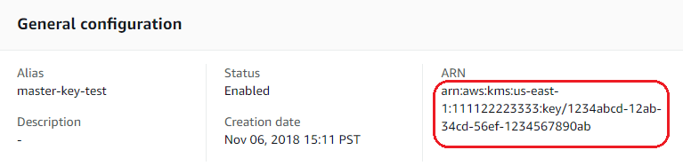

[](https://app.codeac.io/github/aeciopires/my_helm_charts)

# my_helm_charts

<!-- TOC -->

- [my_helm_charts](#myhelmcharts)
- [About](#about)
  - [Contributing](#contributing)
  - [Developers](#developers)
  - [License](#license)
- [Prerequisites to Development and Test of Helm Charts](#prerequisites-to-development-and-test-of-helm-charts)
  - [Configure Access Account AWS](#configure-access-account-aws)
  - [AWS Regions and Availability Zones](#aws-regions-and-availability-zones)
  - [Install Docker-CE](#install-docker-ce)
  - [Install Kops](#install-kops)
  - [Install Terraform 0.11](#install-terraform-011)
  - [Install Terraform 0.12](#install-terraform-012)
  - [Install Kubectl](#install-kubectl)
  - [Install Helm 3](#install-helm-3)
  - [Install Helmfile](#install-helmfile)
  - [Install Sops](#install-sops)
- [Management Kubernetes Cluster in Test Environment in AWS](#management-kubernetes-cluster-in-test-environment-in-aws)
  - [Access SSH Kubernetes Nodes](#access-ssh-kubernetes-nodes)
- [Basic Commands of Helm 3](#basic-commands-of-helm-3)
  - [More Installation Methods](#more-installation-methods)
- [Creating Your Own Charts](#creating-your-own-charts)

<!-- TOC -->

# About

My Helm Charts for Kubernetes.

## Contributing

1. Install: git, kubernetes, aws-cli, helm, helmfile, kustomize, gcloud,
2. Clone the repository to your machine through the command: `git clone https://github.com/aeciopires/my_helm_charts.git`
3. Go to the project folder: `cd my_helm_charts`
4. Create a branch using the pattern: `git checkout -b US-${DEV_NAME}`. Example: *git checkout -b US-AECIO*
5. Develop the task
6. Execute the code in 'development' and 'test' environments
7. Do commit and push files to repository remote with command `git push --set-upstream origin US-${DEV_NAME}`. Example: *git push --set-upstream origin US-AECIO*
8. Create Pull Request (PR) to the `master` branch, using the notations patterns of the development process
9. Update the content with the suggestions of the reviewer (if necessary)

**WARNING:** Before start to contribute, run the command: `git pull origin master` to fetch the newest content of the main branch and avoid conflicts that can make you waste time.

## Developers

developer: Aécio dos Santos Pires<br>
mail: http://blog.aeciopires.com/contato

## License

GPL-3.0 2020 Aécio dos Santos Pires

# Prerequisites to Development and Test of Helm Charts

## Configure Access Account AWS


You will need to create an Amazon AWS account. Create a 'Free Tier' account at Amazon https://aws.amazon.com/ follow the instructions on the pages: https://docs.aws.amazon.com/chime/latest/ag/aws-account.html and https://docs.aws.amazon.com/awsaccountbilling/latest/aboutv2/free-tier-limits.html. When creating the account you will need to register a credit card, but since you will create instances using the features offered by the 'Free Tier' plan, nothing will be charged if you do not exceed the limit for the use of the features and time offered and described in the previous link.

After creating the account in AWS, access the Amazon CLI interface at: https://aws.amazon.com/cli/

Click on the username (upper right corner) and choose the "Security Credentials" option. Then click on the "Access Key and Secret Access Key" option and click the "New Access Key" button to create and view the ID and Secret of the key, as shown below (https://docs.aws.amazon.com/general/latest/gr/managing-aws-access-keys.html). The Access Key and Secret Key shown below are for illustration only. They are invalid and you need to exchange for the actual data generated for your account.

```bash
Access Key ID: YOUR_ACCESS_KEY_HERE
Secret Access Key: YOUR_SECRET_ACCESS_KEY_HERE
```
    
Create the directory below.

```bash
mkdir -p /home/USERNAME/.aws/
touch /home/USERNAME/.aws/credentials
```
    
Access `/home/USERNAME/.aws/credentials` file and add the following content. The Access Key and Secret Key shown below are for illustration only. They are invalid and you need to exchange for the actual data generated for your account.

```bash
[default]
aws_access_key_id = YOUR_ACCESS_KEY_HERE
aws_secret_access_key = YOUR_SECRET_ACCESS_KEY_HERE
```

Install awscli package

CentOS:

```bash
sudo yum -y install awscli
```

Debian/Ubuntu:

```bash
sudo apt-get -y install awscli
```


## AWS Regions and Availability Zones

List of regions and availability zones in AWS.

https://docs.aws.amazon.com/AWSEC2/latest/UserGuide/using-regions-availability-zones.html

## Install Docker-CE

Follow instructions of page for install Docker-CE

* Ubuntu: https://docs.docker.com/install/linux/docker-ce/ubuntu/
* Debian: https://docs.docker.com/install/linux/docker-ce/debian/
* CentOS: https://docs.docker.com/install/linux/docker-ce/centos/


## Install Kops

Simple shell function for kops installation in Linux 64 bits.

Kubernetes documentation:

https://kubernetes.io/docs/getting-started-guides/kops/ 

Copy and paste this code:

```bash
sudo su

function install_kops {
if [ -z $(which kops) ]; then
    curl -LO https://github.com/kubernetes/kops/releases/download/$(curl -s https://api.github.com/repos/kubernetes/kops/releases/latest | grep tag_name | cut -d '"' -f 4)/kops-linux-amd64
    
    chmod +x kops-linux-amd64
    mv kops-linux-amd64 /usr/local/bin/kops
else
    echo "kops is most likely installed"
fi
}
 
install_kops

which kops

kops version

exit
```

---

Credits: Juan Pablo Perez - https://www.linkedin.com/in/juanpabloperezpeelmicro/ 

https://github.com/peelmicro/learn-devops-the-complete-kubernetes-course

---

## Install Terraform 0.11

Simple shell function for Terraform installation version 0.11 in Linux 64 bits.

Terraform documentation:

https://www.terraform.io/docs/index.html

Copy and paste this code:

```bash
sudo su
 
TERRAFORM_ZIP_FILE=terraform_0.11.14_linux_amd64.zip
TERRAFORM=https://releases.hashicorp.com/terraform/0.11.14
TERRAFORM_BIN=terraform11
 
function install_terraform11 {
if [ -z $(which $TERRAFORM_BIN) ]; then
    wget ${TERRAFORM}/${TERRAFORM_ZIP_FILE}
    unzip ${TERRAFORM_ZIP_FILE}
    sudo mv terraform /usr/local/bin/${TERRAFORM_BIN}
    rm -rf ${TERRAFORM_ZIP_FILE}
else
    echo "Terraform 11 is most likely installed"
fi
}
 
install_terraform11
 
which terraform11
 
terraform11 version
 
exit
```

---

Credits: Juan Pablo Perez - https://www.linkedin.com/in/juanpabloperezpeelmicro/ 

https://github.com/peelmicro/learn-devops-the-complete-kubernetes-course

---

## Install Terraform 0.12

Simple shell function for Terraform installation version 0.12 in Linux 64 bits.

Terraform documentation:

https://www.terraform.io/docs/index.html

Copy and paste this code:

```bash
sudo su
 
TERRAFORM_ZIP_FILE=terraform_0.12.20_linux_amd64.zip
TERRAFORM=https://releases.hashicorp.com/terraform/0.12.20
TERRAFORM_BIN=terraform12
 
function install_terraform12 {
if [ -z $(which $TERRAFORM_BIN) ]; then
    wget ${TERRAFORM}/${TERRAFORM_ZIP_FILE}
    unzip ${TERRAFORM_ZIP_FILE}
    sudo mv terraform /usr/local/bin/${TERRAFORM_BIN}
    ln -sfn /usr/local/bin/${TERRAFORM_BIN} /usr/local/bin/terraform
    rm -rf ${TERRAFORM_ZIP_FILE}
else
    echo "Terraform 12 is most likely installed"
fi
}
 
install_terraform12
 
which terraform12
 
terraform12 version
 
exit
```

---

Credits: Juan Pablo Perez - https://www.linkedin.com/in/juanpabloperezpeelmicro/ 

https://github.com/peelmicro/learn-devops-the-complete-kubernetes-course

---

## Install Kubectl

Simple shell function for Kubectl installation in Linux 64 bits

Kubectl documentation:

https://kubernetes.io/docs/reference/kubectl/overview/

Copy and paste this code:

```bash
sudo su
 
KUBECTL_BIN=kubectl
 
function install_kubectl {
if [ -z $(which $KUBECTL_BIN) ]; then
    curl -LO https://storage.googleapis.com/kubernetes-release/release/$(curl -s https://storage.googleapis.com/kubernetes-release/release/stable.txt)/bin/linux/amd64/$KUBECTL_BIN
    chmod +x ${KUBECTL_BIN}
    sudo mv ${KUBECTL_BIN} /usr/local/bin/${KUBECTL_BIN}
else
    echo "Kubectl is most likely installed"
fi
}
 
install_kubectl
 
which kubectl
 
kubectl version
 
exit
```

---

Credits: Juan Pablo Perez - https://www.linkedin.com/in/juanpabloperezpeelmicro/ 

https://github.com/peelmicro/learn-devops-the-complete-kubernetes-course

---

## Install Helm 3

Execute os seguintes comandos para instalar o helm3.

Documentation: https://helm.sh/docs/

```bash
sudo su

HELM_TAR_FILE=helm-v3.0.3-linux-amd64.tar.gz
HELM_URL=https://get.helm.sh
HELM_BIN=helm3

function install_helm3 {

if [ -z $(which $HELM_BIN) ]; then
    wget ${HELM_URL}/${HELM_TAR_FILE}
    tar -xvzf ${HELM_TAR_FILE}
    chmod +x linux-amd64/helm
    sudo cp linux-amd64/helm /usr/local/bin/$HELM_BIN
    sudo ln -sfn /usr/local/bin/$HELM_BIN /usr/local/bin/helm
    rm -rf ${HELM_TAR_FILE} linux-amd64
    echo -e "\nwhich ${HELM_BIN}"
    which ${HELM_BIN}
else
    echo "Helm 3 is most likely installed"
fi
}

install_helm3

which helm3

helm3 version

exit
```

---

Credits: Juan Pablo Perez - https://www.linkedin.com/in/juanpabloperezpeelmicro/ 

https://github.com/peelmicro/learn-devops-the-complete-kubernetes-course

---


## Install Helmfile

Execute os seguintes comandos para instalar o helm.

Documentation: https://github.com/roboll/helmfile

```bash
sudo su
 
HELMFILE_VERSION=v0.99.0
HELMFILE_DOWNLOADED_FILENAME=helmfile_linux_amd64
HURL=https://github.com/roboll/helmfile/releases/download
HELMFILE_URL=${HURL}/${HELMFILE_VERSION}/${HELMFILE_DOWNLOADED_FILENAME}
HELMFILE_BIN=helmfile
 
function install_helmfile {
 
if [ -z $(which $HELMFILE_BIN) ]; then
    wget ${HELMFILE_URL}
    chmod +x ${HELMFILE_DOWNLOADED_FILENAME}
    sudo mv ${HELMFILE_DOWNLOADED_FILENAME} /usr/local/bin/${HELMFILE_BIN}
    echo -e "\nexecuting: which ${HELMFILE_BIN}"
    which ${HELMFILE_BIN}
else
    echo"Helmfile is most likely installed"
fi
}
 
install_helmfile
 
which helmfile
 
helmfile --version
```

---

Credits: Juan Pablo Perez - https://www.linkedin.com/in/juanpabloperezpeelmicro/ 

https://github.com/peelmicro/learn-devops-the-complete-kubernetes-course

---


## Install Sops

Simple shell function for sops installation in Linux 64 bits.

Sops documentation: https://github.com/mozilla/sops

Copy and paste this code:

```bash
sudo su

function install_sops {
if [ -z $(which sops) ]; then
    VERSION_SOPS=$(curl -s https://api.github.com/repos/mozilla/sops/releases/latest | grep tag_name | cut -d '"' -f 4)
    curl -LO https://github.com/mozilla/sops/releases/download/$VERSION_SOPS/sops-$VERSION_SOPS.linux
    mv sops-$VERSION_SOPS.linux /usr/local/bin/sops
    chmod +x /usr/local/bin/sops
else
    echo "sops is most likely installed"
fi
}

install_sops

which sops

sops --version

exit
```

Create and configure the file sops: ``~/.sops.yaml`` with follow content.

```bash
creation_rules:
  - kms: 'PATH_ARN_KEY_SYMMETRIC'
    aws_profile: default
```

Where ``PATH_ARN_KEY_SYMMETRIC`` must be replaced with the symmetric key ARN created in AWS KMS services, as shown in the following example.



---

# Management Kubernetes Cluster in Test Environment in AWS

How to start Kubernetes cluster by using Kops and Terraform

First create a `zone DNS private` in Router53 service of AWS with name `myenvtest.com` or other domain name in region `us-east-2` (Ohio).

Second create a bucket S3 public with name `aecio.myenvtest.com` or other domain name.

```bash
SSH_KEYS=~/.ssh/myenvtest
 
if [ ! -f "$SSH_KEYS" ]
then
    echo -e "\nCreating SSH keys ..."
    ssh-keygen -t rsa -C "myenvtest" -N '' -f ~/.ssh/myenvtest
else
    echo -e "\nSSH keys are already in place!"
fi
 
echo -e "\nCreating kubernetes cluster ...\n"

mkdir -p ~/myenvtest

cd ~/myenvtest

kops create cluster \
 --name=aecio.myenvtest.com \
 --state=s3://aecio.myenvtest.com \
 --authorization RBAC \
 --zones=us-east-2a \
 --node-count=2 \
 --node-size=t2.micro \
 --master-size=t2.micro \
 --master-count=1 \
 --dns private \
 --out=terraform_code \
 --target=terraform \
 --ssh-public-key=~/.ssh/myenvtest.pub

cd ~/myenvtest/terraform_code

terraform11 init
terraform11 validate
terraform11 plan
terraform11 apply
terraform11 show
```

These publicly accessible IP addresses can be retrieved even from your command line

```bash
aws ec2 describe-instances   --query "Reservations[*].Instances[*].{Name:Tags[?Key=='Name']|[0].Value,IP:PublicIpAddress}"   --output=text
```

Get the public IP of instace `master-us-east-2a.masters.aecio.myenvtest.com` and create a entry in `/etc/hosts` file for public IP with name `api.aecio.myenvtest.com` and execute the commands to validate cluster and list nodes.

```bash
kops validate cluster --state=s3://aecio.myenvtest.com

kubectl get nodes --show-labels

ssh -i ~/.ssh/myenvtest admin@api.aecio.myenvtest.com

```

Delete cluster:

```bash
cd ~/myenvtest/terraform_code

terraform11 destroy --auto-approve

kops delete cluster \
 --name=aecio.myenvtest.com \
 --state=s3://aecio.myenvtest.com \
 --yes
```

Update cluster:

```bash
kops update cluster \
 --name=aecio.myenvtest.com \
 --state=s3://aecio.myenvtest.com \
 --out=terraform_code --target=terraform \
 --ssh-public-key=~/.ssh/myenvtest.pub
```

---

Credits: Juan Pablo Perez - https://www.linkedin.com/in/juanpabloperezpeelmicro/ 

https://github.com/peelmicro/learn-devops-the-complete-kubernetes-course

---


## Access SSH Kubernetes Nodes

How to SSH to physical EC2 instances in AWS

```bash
ssh -i ~/.ssh/myenvtest.pub admin@<public_ip_address_of_node_1>
ssh -i ~/.ssh/myenvtest.pub admin@<public_ip_address_of_node_2>
ssh -i ~/.ssh/myenvtest.pub admin@<public_ip_address_of_master>
```

---

Credits: Juan Pablo Perez - https://www.linkedin.com/in/juanpabloperezpeelmicro/ 

https://github.com/peelmicro/learn-devops-the-complete-kubernetes-course

---

# Basic Commands of Helm 3

Add Helm repo official stable charts:

```bash
helm repo add stable https://kubernetes-charts.storage.googleapis.com/
helm repo list
```

Repositories can be removed with `helm repo remove` command.

Once this is installed, you will be able to list the charts you can install:

```bash
helm search repo stable
```

Searches the Helm Hub, which comprises helm charts from dozens of different repositories.

```bash
helm search hub
```

Searches the repositories that you have added to your local helm client (with `helm repo add`). This search is done over local data, and no public network connection is needed.

```bash
helm search repo
```

Install chart of MySQL with default config.

```bash
helm repo update
helm install mydatabase stable/mysql
```

To see what options are configurable on a chart, use the command `helm show values`:

```bash
helm show values stable/mysql
```

List installed charts in Kubernetes cluster.

```bash
helm list --all
```

When a new version of a chart is released, or when you want to change the configuration of your release, you can use the `helm upgrade` command.

```bash
helm upgrade -f values.yaml mydatabase stable/mysql
```

Now, if something does not go as planned during a release, it is easy to roll back to a previous release using `helm rollback [RELEASE] [REVISION]`.

```bash
helm rollback mydatabase 1
```

The above rolls back our `mydatabase` to its very first release version. A release version is an incremental revision. Every time an install, upgrade, or rollback happens, the revision number is incremented by 1. The first revision number is always 1. And we can use helm history [RELEASE] to see revision numbers for a certain release.

Uninstall chart of MySQL.

```bash
helm uninstall mydatabase
```

Optionally if you provide the flag `--keep-history` in uninstall command, the release history will be kept. You will be able to request information about that release:

```bash
helm status mydatabase
```

Because Helm tracks your releases even after you’ve uninstalled them, you can audit a cluster’s history, and even undelete a release (with helm rollback).

---

Credits: Helm Doc Community

* https://helm.sh/docs/intro/quickstart
* https://helm.sh/docs/intro/using_helm

---

## More Installation Methods

The helm install command can install from several sources:

* A chart repository (as we’ve seen above)
* A local chart archive (`helm install foo foo-0.1.1.tgz`)
* An unpacked chart directory (`helm install foo path/to/foo`)
* A full URL (`helm install foo https://example.com/charts/foo-1.2.3.tgz`)

---

Credits: Helm Doc Community

* https://helm.sh/docs/intro/quickstart
* https://helm.sh/docs/intro/using_helm

---

# Creating Your Own Charts

See documentation:

* https://helm.sh/docs/intro/using_helm/#creating-your-own-charts
* https://helm.sh/docs/topics/charts
* https://helm.sh/docs/chart_template_guide/getting_started
* https://helm.sh/docs/topics/chart_best_practices

---

Credits: Helm Doc Community

* https://helm.sh/docs/intro/quickstart
* https://helm.sh/docs/intro/using_helm

---


